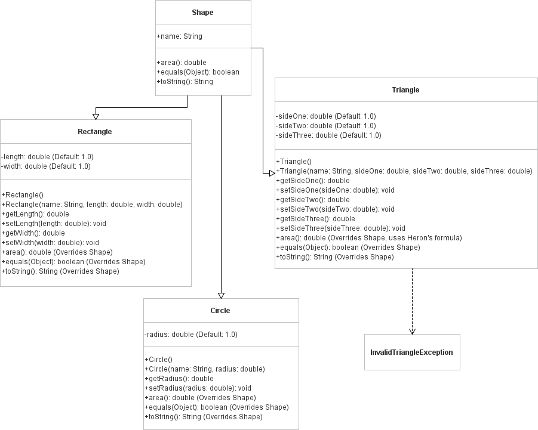

# Shapes Package

This package contains classes related to shapes and their calculations.

## Contents
1. [Shape Class](#shape-class)

## Shape Class

### Description
The `Shape` class is an abstract class representing a generic shape. It provides common properties and functionalities for shapes, including name management and area calculation.

### Fields
- `name`: A string representing the name of the shape.

### Constructors
- `Shape()`: Default constructor that creates a Shape instance with a default name "Shape".
- `Shape(String name)`: Constructs a Shape instance with the given name.

### Methods
- `getName()`: Retrieves the name of this shape.
- `setName(String name)`: Sets the name of this shape to the specified name.
- `abstract double area()`: Abstract method to calculate the area of this shape. Implementation must be provided in subclasses.
- `equals(Object obj)`: Compares this shape with the specified object for equality.
- `toString()`: Returns a string representation of this shape.

### Notes
- This class is abstract and cannot be instantiated directly. Subclasses must implement the `area()` method to provide specific area calculation logic.

## UML Diagram

